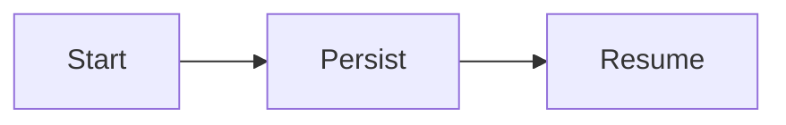

# Blog MDX components

Every file in `src/content/blog` can use these components without importing them. They are registered in `BlogMdxComponents.tsx` and passed to every blog post. Charts, diagrams, tables, captions, and notes share one editorial figure system, so new visuals automatically match existing articles.

## Chart

Use `type="bar"` (the default) or `type="line"`. Readers can toggle series, inspect values with a pointer or keyboard, and switch between the visual and its data table. Every chart also includes a screen-reader table.

```mdx
<Chart
  title="Workflow completion after injected failures"
  description="Successful runs across three recovery strategies."
  type="bar"
  valueSuffix="%"
  domain={[0, 100]}
  data={[
    { label: "No recovery", completion: 38 },
    { label: "Retries only", completion: 71 },
    { label: "Durable runtime", completion: 99.2 },
  ]}
  series={[
    { key: "completion", label: "Completion rate" },
  ]}
  caption="Illustrative comparison; replace with the source and methodology for published results."
  note="Measured on 20 golden workflows."
/>
```

For a multi-series chart, add more numeric keys to each data row and matching series entries:

```mdx
<Chart
  title="Cost per successful workflow"
  type="line"
  valueSuffix="$"
  data={[
    { label: "1K runs", mirrorNeuron: 42, naive: 88 },
    { label: "10K runs", mirrorNeuron: 390, naive: 840 },
    { label: "100K runs", mirrorNeuron: 3700, naive: 8200 },
  ]}
  series={[
    { key: "mirrorNeuron", label: "MirrorNeuron" },
    { key: "naive", label: "Naive chain" },
  ]}
/>
```

## Diagram

Use the component when the diagram needs a title, explanation, or caption. Mermaid diagrams include keyboard-accessible zoom controls and a readable error state:

```mdx
<Diagram
  title="Durable execution loop"
  description="State is committed before the runtime advances."
  source={`flowchart LR
    A[Receive work] --> B[Run step]
    B --> C{Verified?}
    C -->|Yes| D[Commit state]
    C -->|No| E[Retry or pause]
    E --> B
    D --> F[Advance]`}
  caption="A failed process can resume from the last committed state."
/>
```

For a diagram without metadata, a fenced Mermaid block still works:

````mdx

````

## Data table

Use `DataTable` for titled or publication-style tables. Set `highlightColumn` to gently emphasize the primary comparison.

```mdx
<DataTable
  title="Recovery benchmark"
  description="Twenty golden workflows with injected worker and tool failures."
  columns={[
    { key: "metric", label: "Metric" },
    { key: "result", label: "Result", align: "right" },
    { key: "target", label: "Target", align: "right" },
  ]}
  rows={[
    { metric: "Workflow completion", result: "95.0%", target: "95.0%" },
    { metric: "Fault recovery", result: "99.2%", target: "99.0%" },
  ]}
  highlightColumn="result"
  caption="Results shown with the target used for release qualification."
  note="Always include the benchmark base or source in published articles."
/>
```

Normal Markdown tables are also styled automatically and remain the best choice for simple comparisons. They receive the same figure frame, sticky headers and first column, a mobile scroll cue, and keyboard focus treatment.

## Figure

Use `Figure` to give a custom visual the same publication-style shell. `surface="grid"` is useful for diagrams; omit it for screenshots and media.

```mdx
<Figure
  label="System map"
  title="A workflow keeps its durable state outside the worker"
  description="Workers can restart without erasing committed progress."
  surface="grid"
  caption="The event log is authoritative; workers are replaceable."
  note="Conceptual architecture."
>
  <YourVisual />
</Figure>
```

Legacy inline SVG figures are styled automatically. For new diagrams, prefer `Diagram` or a small reusable React component nested inside `Figure` instead of embedding a large SVG in an article.

## Story

Use `Story` for a short, reader-controlled walkthrough. It supports manual steps, play/pause, restart, and an accessible live description. Use `visual="bracket"` for the CAD example or omit `visual` for a generic workflow progression.

```mdx
<Story
  title="From intent to a committed change"
  description="Each transition remains visible and inspectable."
  visual="workflow"
  steps={[
    {
      label: "Select",
      title: "Choose the work object",
      description: "The user selects the object the workflow should change.",
      status: "Object selected",
      evidence: "Semantic reference",
    },
    {
      label: "Commit",
      title: "Record the verified result",
      description: "The accepted result becomes a new durable version.",
      status: "Committed",
      evidence: "Version and trace",
    },
  ]}
  caption="Keep stories focused: usually four to seven steps."
/>
```

## Workbench shell

`WorkbenchShell` renders the reusable workbench anatomy visual used in the interface essay. Its title, description, caption, and note can be adapted without duplicating the diagram markup.

```mdx
<WorkbenchShell
  title="A stable shell around the work"
  description="The domain view changes while operations remain familiar."
  caption="Objects, plans, approvals, and history keep their place."
/>
```

## Callout

```mdx
<Callout title="Why this matters" type="note">
  Durable state turns a restart into a resume instead of a full rerun.
</Callout>
```

`type` can be `note`, `warning`, or `success`.
