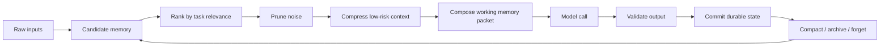
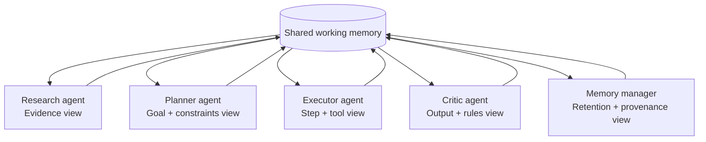
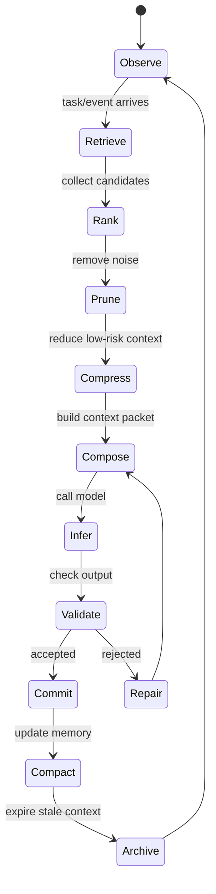

Most people still explain LLM performance through the model:

- bigger model
- longer context window
- better benchmark score
- faster inference

But in real agent systems, failures increasingly come from something else:

**working memory.**

The model may be capable, but the system gives it the wrong context. It sees too much noise, misses the key fact, trusts stale information, forgets what already happened, or mixes private policy with raw user text.

This is why we are moving from **prompt engineering** to **context engineering**.

Prompt engineering asks:

> How should we phrase the request?

Context engineering asks:

> What should exist in the model's working memory right now?

That second question is harder — and much closer to system design.

<Callout title="The mental model">
The LLM is not the whole computer. The LLM is closer to the accelerator: powerful, expensive, and specialized. The agent runtime is closer to the operating system: it schedules work, isolates side effects, tracks state, and recovers from failure. Context management is the working memory subsystem: it decides what the model can see, when it can see it, and why that information belongs there.
</Callout>

## Why agent failures are often memory failures

A single chatbot can survive with a long conversation history.

A multi-agent workflow cannot.

Once agents call tools, share evidence, delegate tasks, retry failed steps, and operate over long periods of time, the system needs a real memory discipline. Otherwise, the workflow turns into a pile of text that everyone reads differently.

Common agent failures are really context failures:

| Failure mode | What it looks like | Memory-design problem |
| --- | --- | --- |
| Context overload | The model sees too much and misses the important part | No prioritization or pruning |
| Missing facts | The agent ignores an earlier decision or requirement | Important state was never promoted into working memory |
| Stale memory | Old facts override newer updates | No freshness, expiry, or conflict policy |
| Summary drift | A compressed summary slowly changes the meaning | Compression is not validated against source state |
| Tool amnesia | The agent repeats an API call or sends duplicate work | Operational state lives only in chat history |
| Policy leakage | Private rules or unsafe data enter the wrong prompt | No boundary between policy, evidence, and task context |
| Cross-agent noise | Every agent sees everything and loses focus | No role-specific context isolation |

The key point:

> Most agent systems do not need more memory. They need better memory management.

## Prompt engineering vs. context engineering

Prompt engineering is still useful. But it is not enough for durable agent systems.

| Layer | Main question | Main artifact | Typical failure |
| --- | --- | --- | --- |
| Prompt engineering | How should the model behave? | Instructions, examples, style rules | The prompt is good, but the evidence is wrong |
| RAG | What external knowledge should we retrieve? | Retrieved chunks | The chunks are stale, duplicated, or too broad |
| Context compression | How do we reduce token cost? | Summaries, compressed text, selected tokens | The wrong details are removed |
| Long-term memory | What should the system remember across sessions? | User facts, project memory, vector/graph records | Memory grows forever or remembers noise |
| Runtime state | What actually happened? | Events, checkpoints, tool calls, approvals | The model invents state from text |
| Context engineering | What belongs in working memory for this step? | Scoped context packet | No policy decides what the model should see |

A useful distinction:

**Prompting shapes behavior. Context engineering shapes operating conditions. Runtime memory preserves truth.**

## The working memory model

A good agent should not send the model "everything we have."

It should send a **scoped working memory image** for the current step.

That working memory image should answer five questions:

| Question | Why it matters |
| --- | --- |
| What is the current goal? | Prevents the model from optimizing for the wrong task |
| What facts are active? | Keeps the reasoning grounded in relevant evidence |
| What has already happened? | Prevents duplicate work and false assumptions |
| What is allowed? | Enforces tool, privacy, and approval boundaries |
| What must be produced? | Makes the output checkable by the runtime |

In other words, context is not just text. It is a **runtime-controlled view of the world**.



The most important part of this loop is the **commit boundary**.

A model response should not automatically become truth. The runtime should interpret it, validate it, and commit only the parts that are safe, useful, and consistent with the workflow state.

## The three kinds of memory every serious agent needs

Most teams talk about "memory" as if it were one thing.

It is not.

A reliable agent system needs at least three different memory types.

### 1. Semantic memory

Semantic memory is what the agent knows for reasoning:

- documents
- prior conversations
- user preferences
- examples
- search results
- retrieved facts
- domain knowledge

This is where RAG, vector search, graph memory, and contextual compression are useful.

But semantic memory is not automatically authoritative. Retrieved text may be stale, duplicated, adversarial, incomplete, or irrelevant. It needs provenance, trust scoring, and conflict handling.

### 2. Operational memory

Operational memory is what the system knows happened:

- tool calls
- retries
- failures
- approvals
- checkpoints
- generated artifacts
- committed side effects
- active branches of a workflow

This memory should not depend on the model "remembering" it.

The runtime should know whether an email was already sent, whether an API call succeeded, whether a file was generated, and whether a human approval is still pending.

### 3. Policy memory

Policy memory defines what the system is allowed to do:

- tool permissions
- data-access rules
- approval thresholds
- privacy boundaries
- escalation paths
- sandbox limits
- forbidden actions

This is where context engineering becomes security engineering.

<Callout title="Context is a capability" type="warning">
Do not treat context as harmless text. A document in the prompt can reveal data, steer behavior, trigger tool use, or contaminate future summaries. Good context engineering includes source trust, permission checks, prompt-injection boundaries, and audit trails.
</Callout>

### Memory separation is the foundation

| Memory type | Owned by | Should the model directly control it? | Example |
| --- | --- | --- | --- |
| Semantic memory | Knowledge layer | Partially | Retrieved product docs for the current question |
| Operational memory | Runtime | No | Step 4 succeeded, retry count is 2, approval is pending |
| Policy memory | System/security layer | No | This agent may draft emails but may not send them |

This separation matters because each memory type has a different failure mode.

Semantic memory can be noisy. Operational memory must be exact. Policy memory must be enforced.

## Multi-agent memory: share less, not more

A common mistake in multi-agent design is to make all agents share the same full context.

That feels collaborative, but it often creates noise.

Human organizations do not work that way. A lawyer, engineer, salesperson, and auditor may work on the same project, but they do not all need the same information at the same time. Each role gets a filtered view shaped by responsibility.

Multi-agent systems need the same pattern.

| Agent role | Should see | Should not see | Why |
| --- | --- | --- | --- |
| Research agent | Source documents, search results, retrieval notes | Private policy rules, unrelated tool logs | Keeps research focused on evidence |
| Planning agent | Goal, constraints, available tools, summarized evidence | Raw noisy transcripts unless needed | Prevents overfitting to low-level details |
| Execution agent | Current step, allowed tools, exact inputs | Full long-term memory or unrelated history | Reduces accidental side effects |
| Critic agent | Proposed output, evidence used, rules to check | Hidden chain of operational retries unless relevant | Focuses review on correctness |
| Memory manager | Events, summaries, provenance, retention policy | Unnecessary private task content | Controls what gets promoted, compressed, or forgotten |

The design principle is simple:

> Shared state should be structured. Agent context should be scoped.

A shared memory layer does not mean every agent sees everything. It means every agent receives the smallest useful view for its role.



The shared memory is not a transcript. It is a structured coordination layer.

## Context as RAM

A useful way to reason about agent context is to map it to computer memory.

| Memory tier | AI-agent equivalent | Design goal | Example |
| --- | --- | --- | --- |
| Register | Current instruction | Tiny, precise, immediately active | "Classify this evidence" |
| L1 cache | Current task facts | Very small, high precision | Active constraint, current user goal |
| L2 cache | Recent tool results and compressed summaries | Fast reuse without flooding the prompt | Last API response, latest plan summary |
| RAM | Queryable working memory | Flexible task-level recall | Project state, selected user preferences |
| Disk | Durable logs and source systems | Full history, not always loaded | Transcripts, files, database rows |
| Kernel state | Runtime checkpoints and permissions | Truth the model should not invent | Approval status, retry count, allowed tools |

This is why "just increase the context window" misses the point.

More RAM does not remove the need for memory management. It makes memory management more important.

## The techniques that matter now

Context engineering has moved beyond naive summaries. The current landscape looks more like a memory hierarchy.

| Technique | What it does | Best used for | Risk |
| --- | --- | --- | --- |
| Importance-based pruning | Keeps high-signal content and drops low-value text | Hot context before model calls | May remove rare but decisive facts |
| Contextual RAG compression | Compresses retrieved documents relative to the query | Retrieval-heavy workflows | May compress away source nuance |
| Adaptive memory | Extracts, updates, and retrieves salient memories | Personal agents and long-running assistants | May remember wrong or sensitive facts |
| Graph memory | Represents relationships among facts | Multi-step reasoning and entity-heavy domains | Graph quality can drift without curation |
| Hierarchical summaries | Compresses chunks into layered summaries | Long documents and repeated loops | Summary drift over time |
| Event logs | Records what happened exactly | Runtime recovery and auditability | Too verbose for direct model context |
| KV-cache compression | Optimizes internal inference memory | Serving infrastructure | Not a replacement for product memory |

The important part is that these layers solve different problems.

Compressing a retrieved document is not the same as remembering a user preference. Remembering a user preference is not the same as knowing whether a tool call already happened. Knowing whether a tool call already happened is not the same as deciding which evidence should enter the next model call.

A serious agent system needs these distinctions.

## Compression is becoming learned

Projects like [LLMLingua](https://github.com/microsoft/LLMLingua) show why context compression is becoming more sophisticated.

The key idea is not simply "summarize the prompt in English." Learned compression can identify lower-value tokens and preserve the parts of context that are more likely to matter for the target model.

That changes the mental model.

Compression does not have to produce beautiful prose for humans. It has to preserve the signal the model needs.

<Callout title="Compression is not the goal">
The goal is not a shorter prompt. The goal is a better working set. A shorter context that removes the wrong detail is worse than a longer context that preserves the right evidence.
</Callout>

## Memory is becoming adaptive

Systems like [Mem0](https://mem0.ai) point at another shift: memory should not be a passive transcript.

A personal or long-running agent should not keep every message forever. It should learn:

- what matters
- what changed
- what expired
- what conflicts
- what should be retrieved only for a specific task
- what should never be used without permission

This is basically **LLM-native garbage collection**.

But adaptive memory alone is not enough. The agent also needs runtime memory: what happened, what was approved, what failed, what can be retried, and what must not be repeated.

That is the missing bridge between memory as personalization and memory as infrastructure.

## The missing layer in personal AI agents

Many personal AI agent frameworks are powerful because they make local workflows tangible. They can operate tools, browse, write files, call APIs, and execute useful actions.

But the memory layer is often still naive.

Context grows uncontrollably.

Old state competes with new state.

Summaries drift.

Tool results are mixed with user intent.

There is no real garbage collector.

There is no adaptive prioritization.

There is no clear boundary between semantic memory, operational state, and policy.

That is the gap.

The next step for personal AI is not only a better model or a larger context window. It is a **working memory layer** between the runtime and the model.

Not a chatbot memory feature.

Not a vector database alone.

A runtime-level subsystem that decides what to keep, compress, forget, retrieve, isolate, and surface at the right moment.

## What a working memory layer should do

A real working memory layer should behave less like a note-taking app and more like an operating-system subsystem.

| Capability | What it means | Why it matters |
| --- | --- | --- |
| Importance scoring | Decide which facts deserve to stay active | Prevents context overload |
| Recency handling | Prefer fresh state without blindly deleting old commitments | Prevents stale-memory bugs |
| Compression | Reduce low-risk context while preserving decisions | Saves tokens without losing truth |
| Forgetting | Remove stale, duplicated, expired, or unsafe context | Keeps memory clean and safe |
| Retrieval routing | Pull from the right memory source for the task | Avoids mixing unrelated knowledge |
| Provenance | Preserve where facts came from and how trusted they are | Enables audit and conflict resolution |
| Role scoping | Give each agent the right view | Reduces multi-agent noise |
| Policy checks | Keep unsafe or unauthorized context out of model calls | Treats context as a capability |
| Runtime integration | Tie memory to checkpoints, retries, approvals, and side effects | Makes agents reliable over time |
| Observability | Record what entered context and why | Makes failures debuggable |

The memory manager should not merely store information. It should make decisions about the working set.

## A useful context packet has structure

One practical shift is to stop thinking in terms of prompts and start thinking in terms of **context packets**.

A context packet is the working memory image sent to the model for one step. It should be explicit about purpose, scope, sources, constraints, permissions, and output expectations.

```yaml
context_packet:
  task:
    goal: "Draft the next email follow-up for approved leads."
    step_id: "campaign.followup.write_variant"
    run_id: "email-campaign-2026-04-21"

  durable_state:
    previous_steps:
      - "audience research completed"
      - "lead list approved by human reviewer"
    pending_approval: false
    retry_count: 1

  memory_policy:
    token_budget: 6000
    keep:
      - "current task"
      - "human approvals"
      - "source-of-record facts"
    compress:
      - "old conversation"
      - "low-risk research notes"
    forget:
      - "expired tool results"
      - "duplicate retrieved chunks"

  working_memory:
    instructions:
      - "Write in a concise, specific, non-spammy tone."
      - "Do not claim a meeting happened unless it appears in source data."
    retrieved_evidence:
      - source: "crm://lead/42"
        trust: "system-of-record"
      - source: "docs://campaign-brief"
        trust: "team-authored"

  boundaries:
    allowed_tools:
      - "draft_email"
    forbidden_actions:
      - "send_email_without_approval"
      - "export_contact_list"

  output_contract:
    format: "json"
    required_fields:
      - "subject"
      - "body"
      - "evidence_used"
      - "needs_human_review"
```

This looks more like an operating-system structure than a prompt.

That is the point.

The model sees enough to reason. The runtime owns the truth.

## Context management needs a lifecycle

A durable AI workflow should manage context like a living resource.



The lifecycle matters because memory changes over time. A fact can be useful now, stale tomorrow, dangerous in another workflow, and irrelevant next week.

Good context engineering is not a one-time prompt trick. It is a continuous memory-management loop.

## Design principles for working memory

The most useful principles are simple:

| Principle | Meaning |
| --- | --- |
| Separate truth from text | Do not let chat history become the database |
| Scope by role | Each agent gets the context needed for its job, not everything |
| Preserve provenance | Every important fact should know where it came from |
| Treat context as permission | If the model can see it, it can influence behavior |
| Compress only with policy | Some information can be compressed; decisions and approvals often should not be |
| Forget deliberately | Stale context is not harmless; it competes with current truth |
| Validate before commit | Model output becomes state only after runtime checks |
| Make context observable | You should be able to inspect why a fact entered the prompt |

## The takeaway

The future is not just better models.

It is not just longer context windows.

It is agents that manage working memory like an operating system:

- what to keep
- what to compress
- what to forget
- what to retrieve
- what to isolate
- what to hide
- what to surface at the right moment

Once context is engineered well, small models can feel bigger, simple agents can behave more reliably, and multi-agent systems can coordinate without drowning each other in noise.

That is where context engineering becomes the foundation — not just a technique.

## References

- Microsoft. "LLMLingua." GitHub. [https://github.com/microsoft/LLMLingua](https://github.com/microsoft/LLMLingua)
- Jiang, H., et al. "LLMLingua: Compressing Prompts for Accelerated Inference of Large Language Models." Microsoft Research / EMNLP 2023. [https://www.microsoft.com/en-us/research/publication/llmlingua-compressing-prompts-for-accelerated-inference-of-large-language-models/](https://www.microsoft.com/en-us/research/publication/llmlingua-compressing-prompts-for-accelerated-inference-of-large-language-models/)
- Mem0. "Memory for AI Agents." [https://mem0.ai](https://mem0.ai)
- Chhikara, P., et al. "Mem0: Building Production-Ready AI Agents with Scalable Long-Term Memory." arXiv, 2025. [https://huggingface.co/papers/2504.19413](https://huggingface.co/papers/2504.19413)
- OpenAI. "Prompt engineering." [https://platform.openai.com/docs/guides/prompt-engineering/strategy-guidance](https://platform.openai.com/docs/guides/prompt-engineering/strategy-guidance)
- Anthropic. "Long context prompting tips." [https://docs.anthropic.com/en/docs/build-with-claude/prompt-engineering/long-context-tips](https://docs.anthropic.com/en/docs/build-with-claude/prompt-engineering/long-context-tips)
- Anthropic. "Model Context Protocol." [https://docs.anthropic.com/en/docs/mcp](https://docs.anthropic.com/en/docs/mcp)
- Liu, N. F., et al. "Lost in the Middle: How Language Models Use Long Contexts." Transactions of the Association for Computational Linguistics, 2024. [https://direct.mit.edu/tacl/article/doi/10.1162/tacl_a_00638/119630/Lost-in-the-Middle-How-Language-Models-Use-Long](https://direct.mit.edu/tacl/article/doi/10.1162/tacl_a_00638/119630/Lost-in-the-Middle-How-Language-Models-Use-Long)
- LangChain. "ContextualCompressionRetriever." [https://reference.langchain.com/python/langchain-classic/retrievers/contextual_compression/ContextualCompressionRetriever](https://reference.langchain.com/python/langchain-classic/retrievers/contextual_compression/ContextualCompressionRetriever)
