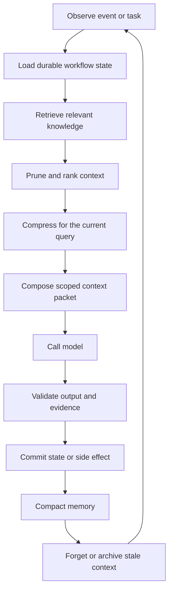

Most people think LLM performance is about better models.

In practice, it is increasingly about something else:

**Context.**

We are moving from prompt engineering to something deeper: **context engineering**. It is not just what you ask. It is what you allow the model to see, what you hide, what you compress, what you retrieve, what you remember, and what you forget.

Most failures in agent systems are not pure reasoning failures. They are context failures:

- too much noise
- missing key facts
- stale memory
- wrong ordering
- untrusted data mixed with trusted state
- a long conversation treated as if it were a database

The shift is clear: the problem is no longer "how do we compress everything?"

The problem is:

> What deserves to exist in context right now?

That is a much harder and more important question.

<Callout title="The mental model">
The LLM is not the whole computer. The LLM is closer to the GPU: powerful, expensive, specialized compute. The agent runtime is closer to the operating system: it schedules work, isolates side effects, tracks state, and recovers from failure. Context management is the memory subsystem: it decides what the model can see, when it can see it, and why that information belongs in the working set.
</Callout>

## Context engineering is bigger than prompt engineering

Prompt engineering asks: how should we phrase the request?

RAG asks: what external knowledge should we retrieve?

Context engineering asks: what is the model's working memory for this step of the workflow?

That includes retrieval, memory, pruning, compression, routing, tool results, permissions, summaries, and durable state. In other words, context engineering is not one trick. It is a system.

| Discipline | Main job | What can go wrong |
| --- | --- | --- |
| Prompt engineering | Shape model behavior with instructions and examples | The model follows instructions but sees the wrong information |
| RAG | Retrieve relevant external knowledge | The retrieved chunks are noisy, stale, duplicated, or too broad |
| Context compression | Reduce token load while preserving useful signal | Compression drops the evidence needed for the task |
| Memory management | Preserve useful long-term facts and discard noise | Memory grows forever or remembers the wrong things |
| Runtime state | Track what happened exactly | The model invents state because the system failed to store it |
| Context engineering | Select and represent the working set under a token budget | The system has no policy for what deserves to be seen |

The practical distinction is simple:

**Prompting shapes behavior. Context engineering shapes operating conditions. Runtime memory preserves truth.**

## The modern context pipeline

The winning pattern is no longer "stuff the prompt."

It looks more like a memory pipeline: retrieve candidates, rank them by the current task, prune noise, compress what remains, update memory, and compose a scoped context packet before the model call.

A serious runtime should not send the model "everything we have." It should send a scoped memory image for a specific step.

The deeper engineering problem is **selection + representation under a token budget**.

That is why attention-based methods are interesting. That is why adaptive memory is rising. That is why static summarization alone is fading.

## The techniques that matter now

Context engineering has moved beyond naive summaries. The current landscape is closer to a memory hierarchy.

| Technique | What it does | Where it fits |
| --- | --- | --- |
| Attention or importance-based pruning | Keeps high-signal tokens and drops low-value text | Hot context before the model call |
| Contextual RAG compression | Compresses retrieved material relative to the query | Retrieval stage |
| Adaptive memory compression | Keeps important memories, filters stale ones, and allocates token budget dynamically | Long-running agents |
| Hierarchical compression | Compresses chunks, then summaries, then higher-level summaries | Long documents and repeated loops |
| Summarization | Produces readable compressed state | Useful, but lossy and prone to drift |
| KV-cache compression | Optimizes internal model inference memory | Infrastructure layer, not product memory |

The important part is that these layers solve different problems.

Compressing a retrieved document is not the same as remembering a user's preference. Remembering a user's preference is not the same as knowing whether a tool call already happened. Knowing whether a tool call already happened is not the same as deciding which evidence should enter the next model call.

The system needs all of these distinctions.

## LLMLingua: compression is becoming learned

[LLMLingua](https://github.com/microsoft/LLMLingua) is a useful signal for where the field is going. The Microsoft project describes a family of prompt and KV-cache compression techniques for delivering the useful parts of context to an LLM more efficiently.

The key idea is not "summarize the prompt in English." LLMLingua uses a compact model to identify less important tokens and compress the prompt while preserving enough semantic structure for the target LLM to perform the task. The project reports up to 20x prompt compression with minimal performance loss in evaluated settings.

That matters because it shows prompt compression can be learned at a token level.

It also changes the mental model. Compression does not have to produce text that looks beautiful to humans. It has to preserve the signal the model needs.

<Callout title="Compression is not the goal">
The goal is not a shorter prompt. The goal is a better working set. A shorter context that removes the wrong detail is worse than a longer context that preserves the right evidence.
</Callout>

## Mem0: memory is becoming adaptive

[Mem0](https://mem0.ai) points at a second shift: memory should not be a passive transcript. It presents memory as an adaptive layer for AI apps, compressing chat history into optimized memory representations so agents can preserve context while reducing token load and latency.

The Mem0 paper frames the problem around long-term conversational coherence. Instead of relying on the full context window, it dynamically extracts, consolidates, and retrieves salient information. Its graph-memory variant models relationships among memories so the system can reason across connected facts.

That is much closer to what personal agents need.

An agent that helps you every day should not keep the entire chat history forever. It should learn:

- what matters
- what changed
- what expired
- what conflicts
- what should be retrieved only for a specific task
- what should never be used without permission

This is basically **LLM-native garbage collection**.

## The missing layer in personal AI agents

This is where many personal AI agent frameworks still feel unfinished.

OpenClaw-style tools are powerful because they make local agent workflows feel tangible. They can operate a desktop, call tools, and execute useful actions. But the memory layer is often still naive.

Context grows uncontrollably.

Old state competes with new state.

Summaries drift.

There is no real garbage collector.

There is no adaptive prioritization.

There is no clear boundary between semantic memory, operational state, and policy.

That is the gap.

The next step for personal AI is not only a better model or a larger context window. It is a memory optimization layer that sits between the runtime and the model.

You could call that layer **OtterCache**: your personal agent's working memory manager.

Not a chatbot memory feature. Not a vector database alone. A runtime-level subsystem that decides what to keep, compress, forget, retrieve, and surface at the right moment.

## Context as RAM

A useful way to reason about this is to map context to memory tiers.

| Memory tier | AI equivalent | Design goal |
| --- | --- | --- |
| L1 cache | Current task instructions, constraints, active evidence | Very small, high precision |
| L2 cache | Compressed RAG results, recent tool outputs, selected summaries | Fast reuse without flooding the prompt |
| RAM | Vector or graph memory, user preferences, project state | Queryable working memory |
| Disk | Logs, full transcripts, artifacts, source systems | Durable history, not always loaded |
| OS state | Workflow checkpoints, retries, approvals, side effects | Truth the model should not invent |

This is why "just increase the context window" misses the point.

More RAM does not remove the need for memory management. It makes memory management more important.

## The runtime is the OS

Operating systems became essential because raw compute was not enough. Programs needed scheduling, isolation, filesystems, process state, permissions, and recovery.

AI systems are reaching the same point.

| Computer systems | AI workflow systems |
| --- | --- |
| GPU | LLM or model endpoint |
| OS scheduler | Agent runtime and workflow scheduler |
| Process memory | Current prompt and tool-visible context |
| Virtual memory | Retrieval, summaries, caches, and long-term stores |
| Page cache | Frequently reused documents, decisions, examples, and tool results |
| Filesystem | Artifacts, logs, datasets, reports, manifests |
| Permissions | Data boundaries, tool policies, approvals, sandbox rules |
| Crash recovery | Durable checkpoints, retries, replay, resume |
| Observability | Event stream, traces, state snapshots, human-readable history |

Without a runtime, the model has to infer state from a pile of text.

With a runtime, the model receives a curated view of the current work, while the system preserves the real state outside the model.

That is the difference between an assistant and infrastructure.

## Context management needs a lifecycle

A durable AI workflow should manage context like a living resource.



The important part is the commit boundary.

A model response should not automatically become truth. It should be interpreted by the runtime, checked against workflow state, and committed only when the step is valid.

That is the difference between chat history and operational memory.

## A useful context packet has structure

One practical way to think about context engineering is to stop building prompts and start building **context packets**.

A context packet is the working memory image sent to the model for one step. It should be explicit about purpose, scope, sources, constraints, and what the model is allowed to do.

```yaml
context_packet:
  task:
    goal: "Draft the next email follow-up for approved leads."
    step_id: "campaign.followup.write_variant"
    run_id: "email-campaign-2026-04-21"

  durable_state:
    previous_steps:
      - "audience research completed"
      - "lead list approved by human reviewer"
    pending_approval: false
    retry_count: 1

  memory_policy:
    token_budget: 6000
    keep:
      - "current task"
      - "human approvals"
      - "source-of-record facts"
    compress:
      - "old conversation"
      - "low-risk research notes"
    forget:
      - "expired tool results"
      - "duplicate retrieved chunks"

  working_memory:
    instructions:
      - "Write in a concise, specific, non-spammy tone."
      - "Do not claim a meeting happened unless it appears in source data."
    retrieved_evidence:
      - source: "crm://lead/42"
        trust: "system-of-record"
      - source: "notion://campaign-brief"
        trust: "team-authored"

  boundaries:
    allowed_tools:
      - "draft_email"
    forbidden_actions:
      - "send_email_without_approval"
      - "export_contact_list"

  output_contract:
    format: "json"
    required_fields:
      - "subject"
      - "body"
      - "evidence_used"
      - "needs_human_review"
```

This looks more like an operating-system structure than a prompt. That is the point.

The model sees enough to reason. The runtime owns the truth.

## The three memories every serious agent needs

Most teams talk about "memory" as one thing. In practice, durable AI workflows need at least three.

### 1. Semantic memory

This is what the model knows for the current reasoning step: documents, prior conversations, user preferences, examples, search results, and retrieved snippets.

This is where RAG and contextual compression help.

But semantic memory is not authoritative by default. Retrieved text may be stale, duplicated, adversarial, incomplete, or irrelevant. It needs provenance and ranking.

### 2. Operational memory

This is what the system knows happened: events, checkpoints, tool calls, failures, retries, approvals, committed side effects, and active branches.

This is where a durable runtime matters.

Operational memory should not depend on the model "remembering" it. The workflow engine should know whether an email was already sent, whether an API call succeeded, and whether a human approval is still pending.

### 3. Policy memory

This is what the system is allowed to do: data access rules, tool permissions, approval thresholds, privacy boundaries, escalation paths, and sandbox limits.

This is where context engineering becomes security engineering.

If a model can see a secret, cite a private document, or call a tool, that context is a capability. Context is not passive information. It changes what the model can do.

<Callout title="Context is a capability" type="warning">
Do not treat context as harmless text. A document in the prompt can reveal data, steer behavior, trigger tool use, or contaminate future summaries. Good context engineering includes source trust, permission checks, prompt-injection boundaries, and audit trails.
</Callout>

## What a memory optimization layer should do

A real memory optimization layer for agents should behave less like a note-taking app and more like an operating-system subsystem.

| Capability | What it means |
| --- | --- |
| Importance scoring | Decide which facts are worth keeping |
| Recency handling | Keep fresh state without blindly deleting older commitments |
| Compression | Reduce low-risk context without losing decisions |
| Forgetting | Remove stale, duplicated, expired, or unsafe context |
| Retrieval routing | Pull memory from the right source for the current task |
| Provenance | Preserve where facts came from and how trusted they are |
| Policy checks | Prevent private or unsafe context from entering the model call |
| Runtime integration | Tie memory to workflow checkpoints, retries, and side effects |

This is the missing layer between "agent can do things" and "agent can keep doing valuable work reliably."

## What MirrorNeuron is optimizing for

MirrorNeuron is built around a simple belief:

**AI workflows should feel easy to write, but the runtime should carry the hard parts.**

That does not mean MirrorNeuron is trying to become your long-term memory database.

Use the memory system that fits your agent: RAG, vector search, graph memory, Mem0-style adaptive memory, a project database, or your own domain-specific store. Those systems can live inside the agent and decide what knowledge should be remembered across days, users, projects, or organizations.

MirrorNeuron focuses on the runtime memory of a workflow run: the data created while work is happening and the operational state needed to continue safely.

The developer should define agents and workflow logic in normal code. The runtime should handle the execution envelope around that logic:

- durable state
- retries and recovery
- event history
- sleep and resume
- tool boundaries
- tool results and generated artifacts
- approvals, checkpoints, and retry attempts
- reusable blueprints
- local, edge, cloud, or cluster execution

This is operational memory, not a replacement for long-term semantic memory.

Context engineering still belongs naturally with the runtime because context is not only what you send to a model. It is also the live working set of a running process: what happened, what was generated, what was approved, what failed, what can be retried, and what must not be repeated.

When the process becomes important, that run-time working set must be managed reliably.

## The takeaway

The future is not just better models.

It is not just longer context windows.

It is agents that manage memory like an operating system:

- what to keep
- what to compress
- what to forget
- what to retrieve
- what to hide
- what to surface at the right moment

Once context is engineered well, small models can start to feel bigger, and simple agents can start to behave like systems.

That is where context engineering becomes the foundation, not just a technique.

## References

- Microsoft. "LLMLingua." GitHub. [https://github.com/microsoft/LLMLingua](https://github.com/microsoft/LLMLingua)
- Jiang, H., et al. "LLMLingua: Compressing Prompts for Accelerated Inference of Large Language Models." Microsoft Research / EMNLP 2023. [https://www.microsoft.com/en-us/research/publication/llmlingua-compressing-prompts-for-accelerated-inference-of-large-language-models/](https://www.microsoft.com/en-us/research/publication/llmlingua-compressing-prompts-for-accelerated-inference-of-large-language-models/)
- Mem0. "Memory for AI Agents." [https://mem0.ai](https://mem0.ai)
- Chhikara, P., et al. "Mem0: Building Production-Ready AI Agents with Scalable Long-Term Memory." arXiv, 2025. [https://huggingface.co/papers/2504.19413](https://huggingface.co/papers/2504.19413)
- OpenAI. "Prompt engineering." [https://platform.openai.com/docs/guides/prompt-engineering/strategy-guidance](https://platform.openai.com/docs/guides/prompt-engineering/strategy-guidance)
- Anthropic. "Long context prompting tips." [https://docs.anthropic.com/en/docs/build-with-claude/prompt-engineering/long-context-tips](https://docs.anthropic.com/en/docs/build-with-claude/prompt-engineering/long-context-tips)
- Anthropic. "Model Context Protocol." [https://docs.anthropic.com/en/docs/mcp](https://docs.anthropic.com/en/docs/mcp)
- Liu, N. F., et al. "Lost in the Middle: How Language Models Use Long Contexts." Transactions of the Association for Computational Linguistics, 2024. [https://direct.mit.edu/tacl/article/doi/10.1162/tacl_a_00638/119630/Lost-in-the-Middle-How-Language-Models-Use-Long](https://direct.mit.edu/tacl/article/doi/10.1162/tacl_a_00638/119630/Lost-in-the-Middle-How-Language-Models-Use-Long)
- LangChain. "ContextualCompressionRetriever." [https://reference.langchain.com/python/langchain-classic/retrievers/contextual_compression/ContextualCompressionRetriever](https://reference.langchain.com/python/langchain-classic/retrievers/contextual_compression/ContextualCompressionRetriever)
