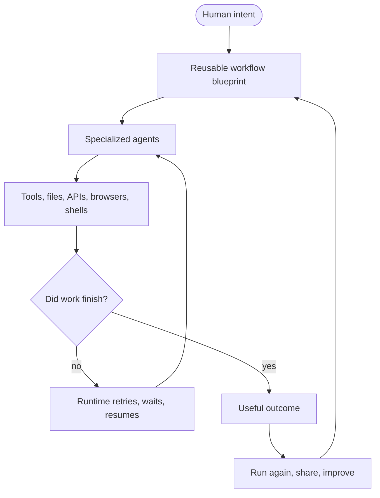

The first wave of AI product design often looked like a familiar computer with an assistant attached.

A desktop gets a copilot. A browser gets a sidebar. An editor gets an autocomplete panel. Useful, yes. Transformational, only partly.

The deeper change is not that every application gets a chat box. The deeper change is that **the workflow becomes the software**.

In an AI-native computer, the important unit is no longer just an app window, a file, or a single prompt. The important unit is a living workflow: agents that understand intent, call tools, wait for events, recover from failure, and keep pushing valuable work forward.

<Callout title="The shift">
If the old computer was organized around apps, the AI-native computer is organized around durable work. The agent runtime becomes the operating layer that keeps that work alive.
</Callout>

## From assistant to workflow

An assistant can answer a question.

A workflow can own an outcome.

That distinction matters. Most valuable work is not one prompt. It is a chain of decisions and actions:

- Research a market, then watch for new signals.
- Draft an email campaign, then test, send, monitor, and adapt it.
- Explore a scientific hypothesis, then run tools, record artifacts, and resume tomorrow.
- Review code, run tests, create a pull request, wait for feedback, and try again.

The moment an agent has to wait, retry, resume, or coordinate with other agents, it stops being a chat interaction. It becomes software.

## The new stack

OpenClaw is interesting because it points at this future. It is not just a tool for making an agent click around. It is a glimpse of a world where the computer becomes programmable through agentic behavior.

But behavior alone is not enough. If an agent can act, it also needs boundaries. If it can run for hours, it needs recovery. If it creates useful work, it needs to be repeatable. If other people depend on it, it needs to be inspectable.

That is why the runtime matters.



This is the shape of AI-native software: not a prompt, not a single agent loop, but a durable workflow around agents and tools.

## Why the runtime becomes the OS

Operating systems exist because programs need shared services: processes, files, networking, permissions, scheduling, and recovery.

AI workflows need their own shared services:

| AI-native need | Why it matters |
| --- | --- |
| Durable state | Work should not disappear when a machine restarts or an API fails. |
| Tool boundaries | Agents need power, but power needs limits. |
| Sleep and resume | Useful agents wait for time, events, approvals, and new data. |
| Observability | People need to inspect what happened and why. |
| Reuse | A useful workflow should become a blueprint someone else can run. |

That is why “workflow runtime” is not boring infrastructure. It is the execution layer for AI-native work.

<Callout title="Why this matters" type="success">
The winning AI products will not only generate better text. They will keep valuable workflows running reliably while humans sleep.
</Callout>

## The mistake is treating agents as scripts

A script is fine when rerunning from the top is cheap.

But many agent workflows are not cheap to restart. They collect context, call external tools, write files, wait for feedback, and build state over time. Losing that progress is not a small bug. It is a product failure.

That is the gap MirrorNeuron is built for.

```python
from mn_sdk import agent, workflow


@agent.defn(type="research")
def research_market(topic: str):
    return {"topic": topic, "signals": ["pricing change", "new competitor"]}


@agent.defn(type="review")
def review_signals(signals):
    return {"priority": "high", "next_step": "draft campaign"}


@workflow.defn(name="MarketWatchWorkflow")
class MarketWatchWorkflow:
    @workflow.run
    def run(self, topic: str):
        result = research_market(topic)
        return review_signals(result["signals"])
```

The code should stay ordinary. The runtime should handle the hard part: running, waiting, retrying, recovering, and making the workflow reusable.

## What changes for builders

If workflows become the software, builders need a different adoption path.

They should not have to start by operating a heavyweight orchestration platform. They should be able to start the way developers like to start: pull a blueprint, run it locally, change the code, and keep ownership as it grows.

```bash
mn blueprints pull market-watch
mn run blueprints/market-watch --set topic="AI infrastructure adoption"
```

That path matters because the AI age will create more software, not less. It will create thousands of small, durable workflows that run for individuals, teams, labs, and companies.

The best runtime will feel simple enough for one person and durable enough when the work becomes important.

## The product surface moves

For a long time, software was mostly screens.

In the AI age, software is increasingly the process behind the screen: the research loop, the review loop, the monitoring loop, the follow-up loop, the simulation loop.

The user may only see the outcome. But the product is the workflow that produced it.

> The workflow is the software. The agent runtime is the operating layer. The blueprint is the new app artifact.

That is the world MirrorNeuron is building for: reliable agent workflows that are simple to adopt, easy to share, and durable enough to matter.

Start with the [blueprints catalog](/blueprints), then make one workflow useful enough that you want it running tomorrow.
