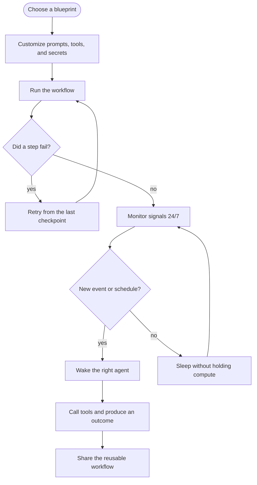

This mock article demonstrates the formats the blog now supports. Use it as a visual checklist when writing future posts about blueprints, engineering decisions, runtime behavior, or customer use cases.

## Why enhanced markdown matters

Technical readers scan before they commit. A good blog post should let them understand the shape of an idea quickly, then dive into the details when they are ready.

- Use short paragraphs for the main argument.
- Use tables when comparing decisions.
- Use code blocks when showing exact implementation.
- Use flowcharts when the sequence matters more than prose.
- Use callouts for warnings, operating assumptions, or key takeaways.

<Callout title="Editorial intent">
Keep the writing practical. MirrorNeuron should feel simple to adopt, but serious enough for durable AI workflows that run in the background.
</Callout>

## Mermaid flowchart demo

Use a fenced `mermaid` block when a post needs a workflow diagram. The renderer uses the Mermaid npm package, so future posts can describe branching workflows directly in markdown.



## Example decision table

Tables are useful when a technical buyer is comparing paths, or when an engineer needs the tradeoffs in one glance.

| Need | Lightweight script | MirrorNeuron workflow |
| --- | --- | --- |
| Run once | Good fit | Also works |
| Sleep and resume | Usually custom glue | Built into the workflow model |
| Retry failed steps | Manual handling | Part of durable execution |
| Share with others | README plus scripts | Reusable blueprint |
| Run at edge or cloud | Depends on setup | Same workflow intent |

## Example code blocks

Code fences now render with a stronger code shell and language label.

```bash
mn blueprints pull email-campaign
mn run blueprints/email-campaign --set objective="reactivate trial users"
```

```python
from mn_sdk import agent, workflow


@agent.defn(type="research")
def collect_signals(topic: str):
    return {"topic": topic, "signals": ["pricing page", "support tickets"]}


@workflow.defn(name="CampaignWorkflow")
class CampaignWorkflow:
    @workflow.run
    def run(self, topic: str):
        signals = collect_signals(topic)
        return {"next_step": "draft campaign", "signals": signals}
```

```ts
import { agent, workflow, workflowRun } from 'mn-sdk';

class CampaignAgents {
  @agent('research')
  collectSignals(topic: string) {
    return { topic, signals: ['pricing page', 'support tickets'] };
  }
}

@workflow('CampaignWorkflow')
class CampaignWorkflow {
  private agents = new CampaignAgents();

  @workflowRun()
  run(topic: string) {
    const signals = this.agents.collectSignals(topic);
    return { nextStep: 'draft campaign', signals };
  }
}
```

```json
{
  "workflow": "CampaignWorkflow",
  "durability": "retry-resume",
  "deployment": ["laptop", "edge", "cloud"],
  "shareable": true
}
```

## Example callouts

<Callout title="Good default" type="success">
Start from a working blueprint, change one useful thing, then let the workflow run long enough to prove value.
</Callout>

<Callout title="Watch out" type="warning">
Do not hide operational assumptions in prose. If a workflow needs Docker, credentials, or a human approval step, make that obvious.
</Callout>

## Example quote

> Durable AI workflows are not just about running agents. They are about making useful work repeatable, recoverable, and understandable by the next person.

## Example checklist

Before publishing a technical post, check that it answers:

1. What problem does this workflow solve?
2. Why does durability matter here?
3. What can the reader run today?
4. What should they customize first?
5. Where should they go next?

For a real implementation path, link readers back to the [blueprints catalog](/blueprints) or the [documentation](https://doc.mirrorneuron.io).
